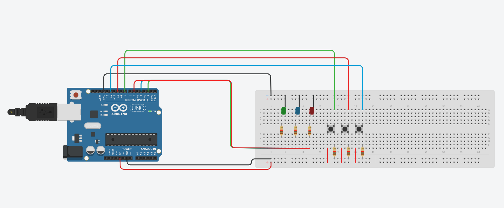

# Battleship-Arduino

Implementation of a Battleship game using Arduino. This project involves the use of basic electronic components and programming to create an interactive version of the classic strategy game.

## Required Materials

- Protoboard
- 3 x LEDs + resistors
- 3 x Buttons + resistors

## Game Description

In BattleShip-Arduino, players select coordinates to position their ships and attempt to hit the opponent's ships. Interaction occurs through the Serial Monitor, where coordinates are chosen, and the outcomes of attempts are displayed.

### Important Rules

- **Using `millis()`**: It is essential to use the `millis()` function for timing. The use of the `delay()` function is forbidden so as not to interfere with the execution of other tasks.

## Game Interfaces

### Initial Interface

1. **LEDs**: All LEDs should be lit.
2. **Serial Monitor**: Displays the message "Press button (1) to start".

### Selection Interface

1. **LEDs**: All LEDs lit.
2. **Serial Monitor**: 
   - "Press button (1) to choose the positions of the ships"
   - "Press button (2) to start the game"

### Ship Positioning Interface

1. **LEDs**: All LEDs lit.
2. **Serial Monitor**: Instructions for choosing the positions of the ships (destroyer and submarine) and to return to the previous menu.

### Mechanics of Positioning

- The map is a 5x5 grid.
- Ships have specific sizes and can be positioned horizontally or vertically, never diagonally.

### Gameplay Mechanics

1. **Beginning of the Game**: Arduino randomly selects the positions of the ships.
2. **Player's Turn**: 
   - Lights up LED 1.
   - Enters the target coordinate on the Serial Monitor.
   - Possible outcomes: "Target located!" or "Target missed!".
3. **Arduino's Turn**: 
   - Lights up LED 2.
   - Selects a coordinate to attack.
   - The outcome is displayed on the Serial Monitor.

### Controls During the Game

- **Button 1 (or 2)**: Shows the coordinates of located targets and missed attempts.
- **Button 3**: Ends the game. All LEDs flash for 3 seconds.

### Victory Conditions

- The winner is whoever hits all the targets first.
- In case of victory, all LEDs light up, and a victory message is displayed on the Serial Monitor.

### Turn Time

- The player has 30 seconds to choose the target. After this time, they lose their turn.

---

## Circuit Example

Below is an example of the circuit used in the project:

----

----

----

# Batalha Naval-Arduino

Implementação de um jogo de batalha naval utilizando Arduino. Este projeto envolve o uso de componentes eletrônicos básicos e programação para criar uma versão interativa do clássico jogo de estratégia.

## Material Necessário

- Protoboard
- 3 x LEDs + resistores
- 3 x Botões + resistores

## Descrição do Jogo

No BattleShip-Arduino, os jogadores selecionam coordenadas para posicionar seus navios e tentar atingir os navios adversários. A interação ocorre através do Monitor Serial, onde as coordenadas são escolhidas e os resultados das tentativas são exibidos.

### Regras Importantes

- **Utilização de `millis()`**: É essencial usar a função `millis()` para temporizações. O uso da função `delay()` está proibido para não interferir na execução das demais tarefas.

## Interfaces do Jogo

### Interface Inicial

1. **LEDs**: Todos os LEDs devem estar acesos.
2. **Monitor Serial**: Exibe a mensagem "Pressione o botão (1) para iniciar".

### Interface de Seleção

1. **LEDs**: Todos os LEDs acesos.
2. **Monitor Serial**: 
   - "Pressione o botão (1) para escolher as posições dos navios"
   - "Pressione o botão (2) para iniciar o jogo"

### Interface de Posição dos Navios

1. **LEDs**: Todos os LEDs acesos.
2. **Monitor Serial**: Instruções para escolher as posições dos navios (torpedeiro e submarino) e para retornar ao menu anterior.

### Funcionamento da Escolha de Posição

- O mapa é um grid de 5x5.
- Os navios têm tamanhos específicos e podem ser posicionados horizontal ou verticalmente, nunca diagonalmente.

### Funcionamento do Jogo

1. **Início do Jogo**: O Arduino escolhe aleatoriamente as posições dos navios.
2. **Jogada do Jogador**: 
   - Aciona o LED 1.
   - Insere a coordenada do alvo no Monitor Serial.
   - Resultados possíveis: "Alvo localizado!" ou "Alvo perdido!".
3. **Jogada do Arduino**: 
   - Aciona o LED 2.
   - Escolhe uma coordenada para o ataque.
   - O resultado é exibido no Monitor Serial.

### Controles durante o Jogo

- **Botão 1 (ou 2)**: Exibe as coordenadas dos alvos localizados e das tentativas perdidas.
- **Botão 3**: Encerra o jogo. Todos os LEDs piscam por 3 segundos.

### Condições de Vitória

- O vencedor é quem acertar todos os alvos primeiro.
- Em caso de vitória, todos os LEDs acendem e uma mensagem de vitória é exibida no Monitor Serial.

### Tempo de Jogada

- O jogador tem 30 segundos para escolher o alvo. Passado esse tempo, perde a vez.

---

## Exemplo de Circuito

Abaixo está um exemplo do circuito utilizado no projeto:

